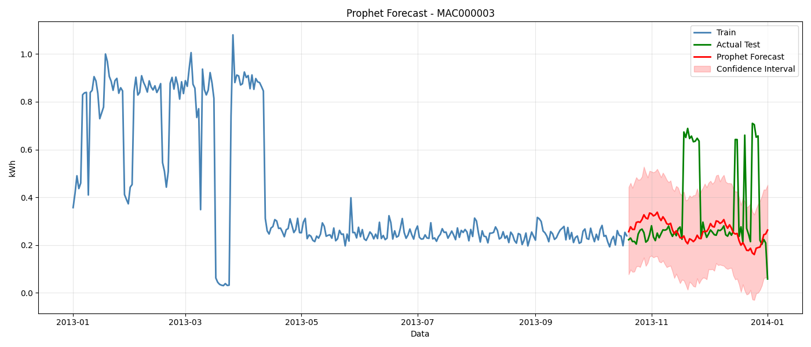
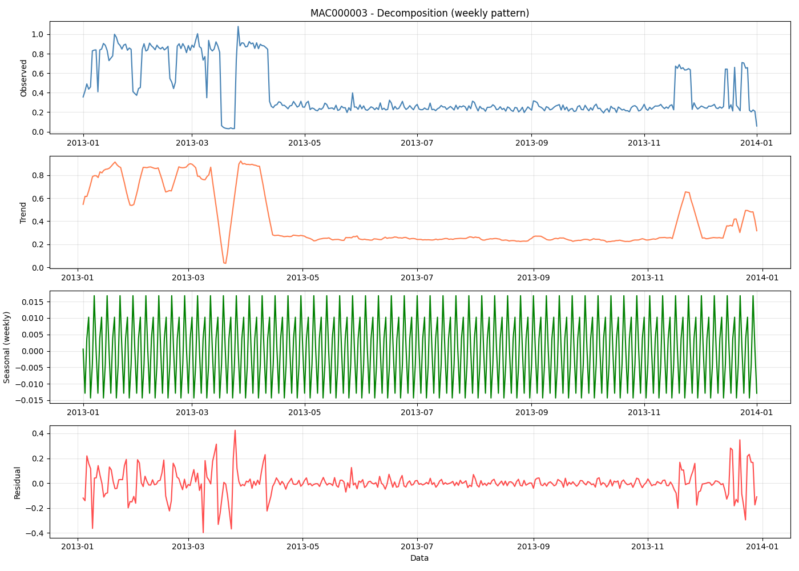
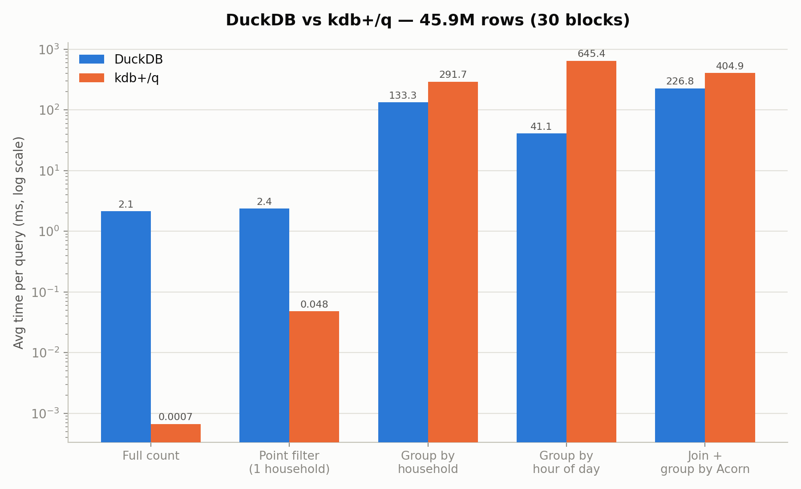
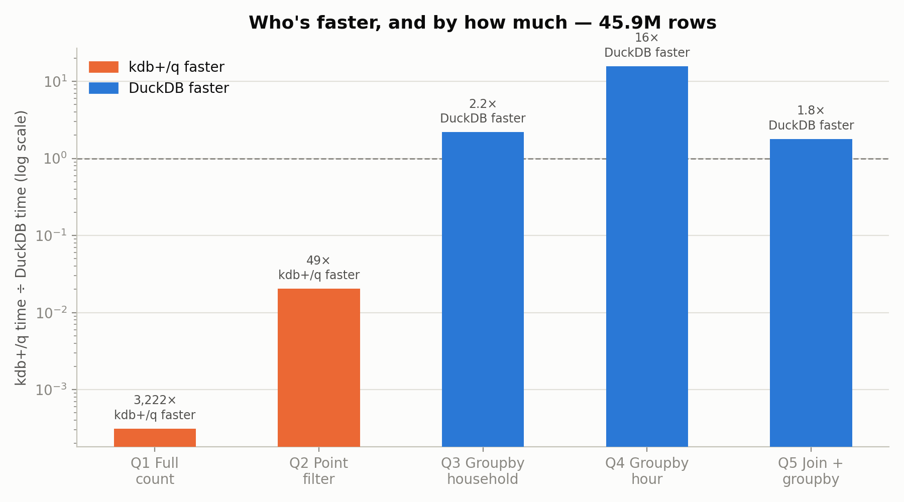
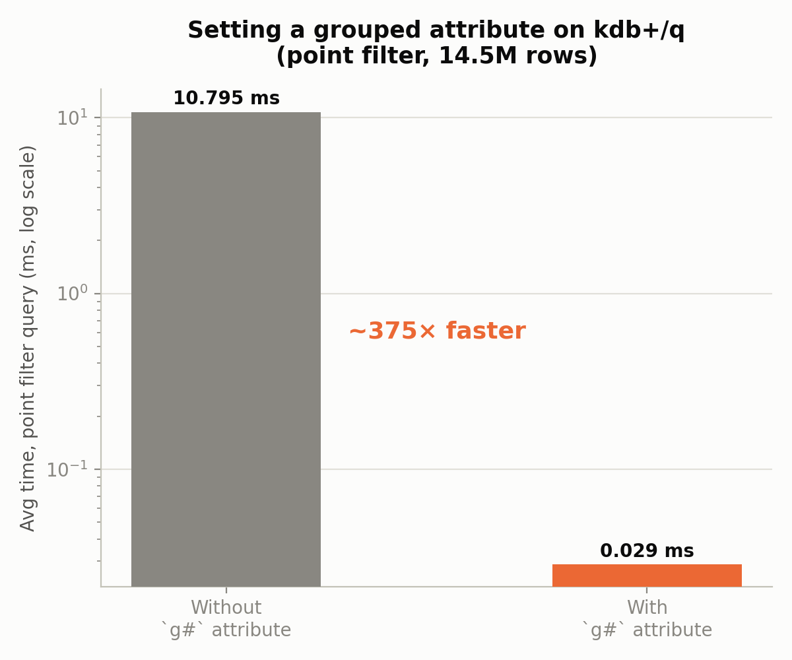

# Smart Meter Energy Analytics — AWS Time-Series Forecasting & KDB+/Q vs SQL Benchmark

Two-part project built on the "Smart meters in London" half-hourly household energy
dataset. **Part 1** covers a full AWS-based time-series analysis pipeline (S3 →
Athena → Python), including consumption segmentation, anomaly detection, and
Prophet forecasting. **Part 2** is a from-scratch, locally-run performance
benchmark comparing **KDB+/Q** against **SQL (DuckDB)** on the same raw dataset —
built to develop hands-on KDB+/Q skills ahead of a Junior KDB+/Q Developer
interview.

## Part 1 — AWS Time-Series Forecasting

Cloud-native pipeline: raw meter readings land in **S3**, are queried with
**Athena/Presto-Trino SQL**, and pulled into Python (pandas/statsmodels/Prophet)
for cleaning, segmentation, decomposition, and forecasting. No EC2 — compute is
serverless query + local analysis.

**Dataset:** 587 MB, 17,520 observations × 4,444 columns, 4,443 meters, 30-minute
intervals, full year 2013. Source: [4TU.ResearchData](https://data.4tu.nl/).
Cleaned down to 4,138 meters (305 dropped for >20% missing data).

**Consumption segmentation:**

| Segment | Meters | Share | Avg. consumption |
|---|---|---|---|
| Industrial | 1,407 | 34% | 6,478 kWh |
| Commercial | 1,365 | 33% | 3,099 kWh |
| Residential | 1,364 | 33% | 1,549 kWh |
| Inactive | 2 | — | — |

**Forecasting (Prophet), MAE by segment sample meter:**

| Segment | Meter | MAE |
|---|---|---|
| Residential | MAC003008 | 0.0360 |
| Commercial | MAC004186 | 0.0702 |
| Industrial | MAC004179 | 0.4946 |

Stationarity confirmed via ADF test (p = 0.000441). Anomaly detection cross-checked
with two independent methods — Z-score (7 flagged) and IQR (8 flagged), 87.5%
agreement — with the top anomaly on 18 Feb 2013 (278.0 kWh).

**Tools:** AWS S3 · Athena · pandas/numpy · statsmodels · Prophet · Plotly/matplotlib · SQL (Presto/Trino)

Notebooks: [`aws_proj.ipynb`](aws_proj.ipynb), [`proj_time_series.ipynb`](proj_time_series.ipynb), [`london.ipynb`](london.ipynb)




## Part 2 — KDB+/Q vs SQL (DuckDB) benchmark

Same dataset, taken all the way down to the raw half-hourly CSVs (~167M rows
across 112 blocks) and run through identical queries in **KDB-X 5.0 Community
Edition** (kdb+/q, via WSL2) and **DuckDB** (Python), on the same machine, in the
same WSL environment, for a fair, same-hardware comparison. Full code, methodology
and findings: [`part2_kdb_vs_sql/`](part2_kdb_vs_sql/).

**Headline results — 30 blocks / 45,948,372 rows, avg. of 3 runs (ms):**

| Query | DuckDB | kdb+/q | Faster engine |
|---|---:|---:|---|
| Q1 — full row count | 2.15 | 0.0007 | kdb+/q, ~3,220× |
| Q2 — point filter (1 household) | 2.36 | 0.048 | kdb+/q, ~49× |
| Q3 — group by household | 133.33 | 291.66 | DuckDB, ~2.2× |
| Q4 — group by hour of day | 41.12 | 645.38 | DuckDB, ~15.7× |
| Q5 — join + group by Acorn group | 226.80 | 404.89 | DuckDB, ~1.8× |




**Key findings:**

- **Attributes matter — a lot.** Setting a `` `g# `` (grouped) attribute on the
  filter column turned the point-filter query from a 10.79 ms linear scan into a
  0.029 ms hash lookup — a **~375× speedup** — for a one-time indexing cost of
  under a second. Without it, kdb+/q loses even the point-filter query to DuckDB.

  

- **kdb+/q wins decisively on narrow, selective operations** (counts, point
  lookups) where its in-memory columnar design and attribute indexing shine, but
  **loses to DuckDB's query optimizer on heavier grouping/join workloads** — a
  genuinely mixed result, not a blanket "kdb+ is faster" story.
- **A negative result, reported honestly:** hypothesized that `` `hh:tstp.hh ``
  (temporal accessor) was the Q4 bottleneck and tested an alternative extraction
  (`` (`int$`minute$tstp) div 60 ``) — timings came back statistically identical
  (645.38 ms vs 649.71 ms), disproving the hypothesis. The real cost is the
  group-by-on-derived-column mechanism itself, not the extraction method.
- **A real infrastructure limit, not a bug:** kdb+/q loaded the full 112-block
  dataset (167.8M rows, ~15.2 min) but was then OOM-killed by WSL2's memory
  ceiling while holding all 112 intermediate tables in memory pre-concatenation.
  30 blocks (45.9M rows) was chosen as a safe, repeatable scale for the final
  benchmark rather than guessing at an untested larger one.
- **Data quality handled explicitly:** 50 rows per block carry the literal string
  `"Null"` instead of a numeric reading in the energy column — converted to a
  proper null in both engines rather than erroring or silently dropping rows.

**Tools:** KDB-X 5.0 Community Edition (kdb+/q) · DuckDB · Python · WSL2/Ubuntu · matplotlib

## Project structure

```
.
├── aws_proj.ipynb                 # Part 1 — main AWS/Athena analysis notebook
├── proj_time_series.ipynb         # Part 1 — time-series decomposition & forecasting
├── london.ipynb                   # Part 1 — S3/Athena data access
├── data/                          # Part 1 — small derived tables (segmentation, anomalies)
├── visualisations/                # Part 1 — chart exports
├── *.png                          # Part 1 — chart exports (root level)
└── part2_kdb_vs_sql/
    ├── benchmark_q.q              # kdb+/q benchmark script
    ├── benchmark_duckdb.py        # DuckDB benchmark script
    ├── results_q.csv              # kdb+/q results (30-block run)
    ├── results_duckdb.csv         # DuckDB results (30-block run)
    ├── main_comparison.png        # chart: headline comparison
    ├── speedup_factor.png         # chart: per-query speedup/slowdown
    ├── attribute_impact.png       # chart: g# attribute before/after
    └── README.md                  # Part 2 — full methodology
```

## Running Part 2 locally

Requires WSL2/Ubuntu (or Linux), [KDB-X Community Edition](https://kx.com/kdb-downloads/),
and Python 3 with DuckDB. The raw dataset (~167M rows, too large for this repo) is
not included — see [`part2_kdb_vs_sql/README.md`](part2_kdb_vs_sql/README.md) for
the dataset source and full run instructions.

```bash
cd part2_kdb_vs_sql
export SQL_KDB_DATA_DIR=/path/to/dataset

# DuckDB
python3 benchmark_duckdb.py 30 3

# kdb+/q
q benchmark_q.q 30 3
```

## Data sources

- Part 1: [4TU.ResearchData](https://data.4tu.nl/) — Low Carbon London smart meter dataset
- Part 2: [Kaggle — Smart meters in London](https://www.kaggle.com/datasets/jeanmidev/smart-meters-in-london) (`jeanmidev/smart-meters-in-london`)

## Author

Sławomir Strzelec — [portfolio](https://github.com/slastrzelec)
